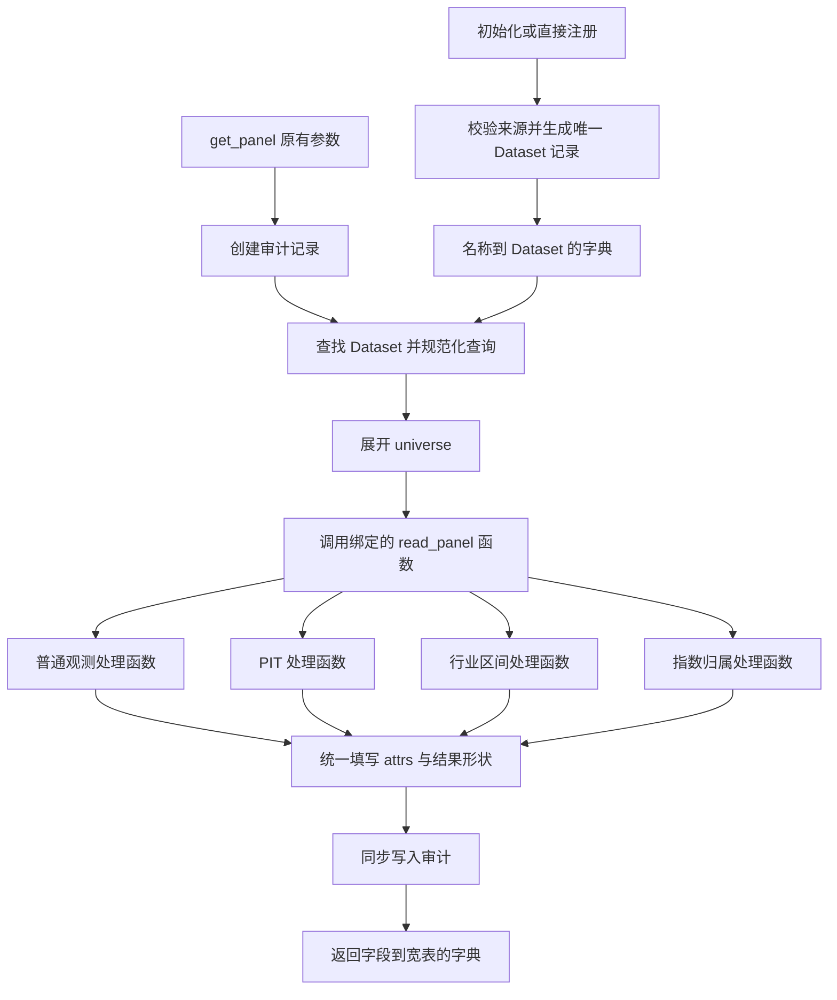

> 历史方案：Tushare 远端及双来源设计已废止。当前仅本地存档，事件面板日历来自 ClickHouse daily；以 `.agent/architecture.md` 为准。

# quant_data 重构方案

审查基线：`680ab80`，2026-09-05。本文依据当前源码、测试和项目约束编写。仅产出方案，未修改项目源码，未运行测试或性能基准；下文性能问题均区分为源码可见的重复工作与有待测量的瓶颈。

**核心建议：保留 `DataClient.get_panel()`，用一个内部数据集记录直接绑定处理函数。注册时解决“这个名字对应什么数据、从哪里读、如何生成面板”；查询时只执行已经确定的路径。**

连接复用、字段 schema、财务 PIT、行业区间、股票池与审计继续保留。删除的是重复描述、反复判型和跨模块私有调用，而不是这些功能本身。

## 1. 对当前架构的判断

你的判断在“抽象过多、阅读成本过高”上有充分依据，但“类多导致性能差”目前不能直接成立。

`DatasetSpec` 是用户输入，`RegisteredDataset` 是校验后的状态，catalog 是内置数据定义。这些概念本来不同。问题在于当前实现让它们同时进入查询链，查询代码需要不断重新解释它们之间的关系。

例如，当前链路大致是：

```text
DatasetSpec 的某个变体
  → DataClient.register
  → Backend.prepare
  → RegisteredDataset(spec + schema + source + contract + adjustment)

get_panel
  → 按 spec.backend 查 Backend
  → 按 spec 类型判断是不是 Tushare
  → cast 为 TushareSemanticBackend
  → 再取 panel_kind
  → 调语义扫描方法
  → 扫描方法拆 spec/source、再查 catalog
  → 执行不同的面板构建
```

真正值得重构的点如下。

| 现状 | 影响 | 重构决定 |
|---|---|---|
| `RegisteredDataset` 同时包住 `spec`、`contract` 和 `source: Any` | 同一数据集信息分散；类型包装很多，却仍靠运行时拆包和检查 | 合并成唯一内部 `Dataset` 记录；运行期间不保留旧 Spec 链 |
| 本地与远端 Tushare Spec 重复声明 lag、calendar、buffer、fixed_params 等 | 同一业务语义因存储位置不同而复制 | Tushare 语义共用，来源选择在注册工厂中完成 |
| `DataClient` 认识 Tushare、ClickHouse 来源类型和 `BuiltInDatasetSpec` | 每加一类特殊数据，公共入口跟着变化 | 公共入口只认识 `Dataset`；特有行为交给已绑定函数 |
| `DataBackend` 之外再加 `TushareSemanticBackend` | 统一协议无法真正统一，只能继续增加扩展接口 | 删除这两层协议；使用明确的函数签名 |
| 远端 Tushare 实现无实际工作的 `normalize_snapshot_query` | 为接口整齐而添加空操作 | 快照范围检查只存在于本地快照处理路径 |
| Parquet 后端调用 `TushareBackend` 的私有方法 | 存储实现和数据语义相互依赖 | 公共规范化与领域算法移到普通函数；两个来源平等调用 |
| 行业区间展开写在 Tushare 后端中 | 本地来源被迫依赖远端后端 | 移到纯变换模块 |
| `membership_events` 跨源读取写在 `DataClient` 中 | 通用客户端直接维护特殊数据集流程 | 用独立数据集处理函数承接 |
| `_ClickHouseRegistration` 仅把字段再次复制到 Spec | 多一套没有独立职责的数据描述 | 默认配置直接调用最终注册工厂 |

证据主要在 `models.py:304`、`client.py:315`、`client.py:437`、`backends/base.py:78`、`backends/tushare.py:159`、`backends/parquet.py:241` 和 `backends/tushare.py:946`。

也有一些现有设计值得留下：

- `transforms/membership.py` 只有 37 行，已经是职责清楚的纯函数，无需重写。
- `_universes.py` 中缓存历史状态的 `UniversePanel` 有实际用途，无需拆成几个同步维护的字典。
- ClickHouse/Tushare 的连接与交易日历缓存是有状态资源，使用类管理是合适的。
- Arrow schema 和字段 catalog 是数据契约，不属于应删除的框架装饰。`tushare_schemas.py` 大量篇幅是字段定义，不能用总行数衡量过度设计。
- `QueryAudit` 和 `AuditWriter` 直接承担审计记录与持久化职责。把它们改名或改成字典不是本次收益来源。

## 2. 重构范围与兼容边界

必须保持下面的调用签名、位置参数顺序、默认值和关键字参数风格：

```python
def get_panel(
    self,
    dataset: str,
    fields: Sequence[str],
    start: Any | None = None,
    end: Any | None = None,
    instruments: Sequence[str] | None = None,
    adjusted: bool | None = None,
    *,
    universe: str | None = None,
) -> dict[str, pd.DataFrame]:
    ...
```

始终返回“字段名 → Pandas 宽表”的字典，包括只查询一个字段时。不能改成直接返回单个 DataFrame、MultiIndex 大表、惰性查询对象或新的 Result 包装。

“日期 × 股票代码”应理解为“时间 × 证券”：当前分钟、秒及毫秒时间精度、时区、自定义键名与可选频率元数据都属于保留范围。

用户只要求保留 `get_panel()`，因此注册 API 和内部类不承担永久兼容义务。本方案采用以下具体迁移策略：

1. 保留 `initialize_data_client()` 的现有参数和默认行为，减少常用入口迁移成本。
2. 新注册方式使用直接方法传参，不要求用户创建 Spec 对象。
3. 实施过程中暂时允许旧 Spec 通过一个入口转换为新 Dataset，以便复用现有测试和逐类切换。
4. 交付目标删除旧 Spec 导出、旧 Backend 协议和临时转换层；同步更新 README、初始化辅助函数及测试。若实施方另有外部调用兼容需求，可以把转换层作为单独迁移包保留，但不让它进入核心查询链。

不在此次方案中增加 `get_table()`、新查询参数、插件系统、分布式执行、异步公共接口或任意流水线配置语言。

## 3. 目标架构：名字直接对应可执行的数据集



图中的四条处理路径是注册时绑定的函数，不是要求公共客户端每次再写四分支判断。

### 3.1 仅保留一个核心数据集记录

以下是目标形状，属于设计示意，不要求照抄字段顺序：

```python
Panels = dict[str, pd.DataFrame]

@dataclass(frozen=True, slots=True)
class Query:
    dataset: str
    fields: tuple[str, ...]
    start: datetime | None
    end: datetime | None
    instruments: tuple[str, ...] | None
    adjusted: bool

@dataclass(frozen=True, slots=True)
class Dataset:
    schema: pa.Schema
    time_column: str                 # 输出面板的键名
    instrument_column: str
    query_timezone: str | None       # 查询边界的解释规则
    frequency: str | None
    version: str | None
    requires_range: bool
    instrument_suffixes: tuple[str, ...] | None
    adjustment: PriceAdjustment | None
    read_panel: Callable[[Query, QueryAudit], Panels]
    fingerprint: Callable[[], dict[str, object]]
```

`Dataset` 是注册完成后的唯一运行时记录，不是把 `RegisteredDataset` 改个名字。它不包含旧 `spec`、独立 `contract`、不透明 `source: Any`，也不要求查询方根据类型重新解释它。

记录中只放公共查询校验和收尾确实需要的事实。PIT 公告列、报告期列、区间端点、API 名、manifest 分区等不必全部摊成这个结构中的可空字段，放在各处理函数绑定的已校验参数中。

`PriceAdjustment` 可继续作为只有因子列、适用字段、默认开关的小型值对象。目标是消除重复职责，不是限定整个项目只能有两个 class。

保留两个可调用项各有原因：

- `read_panel(query, audit)`：读取并生成所需宽表，直接补充实际 API、日历等审计事实。
- `fingerprint()`：在通用验证前取得来源信息，保留验证失败时的来源审计；本地文件的当前元信息也不应被一次性静态字典取代。

不要继续增加 `prepare_query`、`before_scan`、`after_scan`、`get_semantics` 等任意 hook。来源特有的检查直接写进该来源的处理函数即可。

注册工厂可以使用局部闭包或 `functools.partial` 绑定已校验参数。优先给处理函数明确名称，便于搜索和定位；不要动态生成匿名执行图。

### 3.2 公共查询流程

入口伪代码应接近下面的长度和责任范围：

```python
def get_panel(self, dataset, fields, start=None, end=None,
              instruments=None, adjusted=None, *, universe=None):
    record = create_audit_record(...)
    try:
        entry = lookup_dataset(self._datasets, dataset)
        record.frequency = entry.frequency
        record.dataset_version = entry.version
        record.source = entry.fingerprint()
        query = normalize_query(entry, dataset, fields, start, end,
                                instruments, adjusted, universe)
        query = expand_universe_if_requested(query, universe, record)
        panels = entry.read_panel(query, record)
        attach_panel_metadata(panels, entry, query, record)
        record.status = "success"
    except Exception as exc:
        record.status = "failed"
        record.error = sanitized_error(exc)
        raise
    finally:
        record.duration_ms = elapsed_ms(...)
        self._audit.write(record)
    return panels
```

实现时保留通用验证与实际 I/O 的顺序约束：创建审计在先，日期规范化在股票池展开之前，展开在数据查询之前，无效请求不发数据 API。来源指纹读取文件元信息不等同于执行数据查询。

`normalize_query` 使用已经解析好的元数据，不再问“是不是 ClickHouseDatasetSpec”。例如需要代码后缀的规则由注册工厂写入 `instrument_suffixes`。

来源特有的快照越界检查、PIT fetch 范围、API 路由选择属于对应处理函数。它们在执行数据请求前完成。面板算法设置 `calendar_aligned` 等实际结果状态，公共入口统一写最终 attrs。

查询级状态只写入本次 Query/QueryAudit，不写入共享 Dataset 或闭包中的可变配置。`fingerprint()` 每次返回独立字典；工厂对调用方提供的 `fixed_params`、路径与字段序列复制并归一化，避免注册完成后被外部修改。快照分区、物理 schema 和 SQL 时间表达式等有实际用途的已校验状态可以保存，关键是不再保留一份旧 Spec 供执行阶段重新解释。

成功时审计持久化失败仍抛 `AuditWriteError`。查询已失败且审计也失败时，保留现有外层审计错误行为，并使用异常链保留原查询错误。不能让 `finally` 吞掉异常或返回部分结果。

当前代码对完全不符合参数类型的输入存在审计创建前就失败的缺口，例如 `fields=None` 的 `list(fields)`。实施时应把可控的原始参数序列化纳入失败审计路径；不要把这个缺口固化成兼容要求。已支持的参数和明确验证失败行为必须保留；未声明输入、多项参数同时非法时的全部错误文案及优先级，不应成为保留旧结构的理由。

### 3.3 reader 与处理函数的边界

| 单元 | 输入和输出 | 职责 |
|---|---|---|
| 来源 reader | 已校验来源参数、投影与过滤条件 → Arrow 长表 | SQL/API/文件访问、来源格式规范化、必要的读取校验 |
| 数据集处理函数 | Query、QueryAudit → 字段到宽表的字典 | 组织读取、辅助日历、领域变换及来源专属审计 |
| 纯 transform | Arrow 长表、列名、日历、明确规则 → 宽表或中间状态 | 普通透视、PIT、区间、指数归属算法；不访问网络和文件 |
| Session | 连接名、连接配置 → 复用客户端 | 凭据延迟解析、连接替换和关闭、日历缓存 |

处理函数可以返回最终宽表，reader 仍返回 Arrow 长表。这是两个不同边界，不应强迫 PIT reader 提前 pivot，也不应为多带一个日历再创建通用 `ScanResult`、`ExecutionContext` 或 `PanelResult` 包装。

`income` 和 `balancesheet` 应共享同一个财务处理函数，只绑定不同列定义与 API 路由；“每个数据集绑定函数”不意味着为每个数据集复制一份实现。

## 4. 模块落点与依赖方向

建议沿现有目录演进，避免为重构额外制造一套框架目录：

```text
quant_data/
  client.py                    # 公共 API、通用规范化、universe、结果收尾
  models.py                    # Dataset、Query、凭据配置、小型实际值对象
  datasets.py                  # 明确的注册工厂与四类数据集处理函数
  initialize.py                # 环境配置与默认注册；无中转 Spec
  audit.py                     # QueryAudit / 审计持久化
  _universes.py                # 保留历史股票池加载与选择
  exceptions.py
  backends/
    clickhouse.py              # session、schema 发现、SQL/Arrow reader
    parquet.py                 # 通用 Parquet reader
    tushare.py                 # session、API 请求、交易日历缓存
    tushare_archive.py         # manifest、分区校验与本地快照 reader
    tushare_common.py          # 来源共用的列/日期/固定参数规范化函数
    clickhouse_catalog.py      # 内置物理字段契约
    tushare_catalog.py         # 静态逻辑数据定义及请求配置
    tushare_schemas.py          # 保留有序 Arrow 字段契约
  transforms/
    panel.py                   # 普通观测
    pit.py                     # 披露与修订
    intervals.py               # 从 Tushare 后端移出的有效区间逻辑
    membership.py              # 包内指数归属事件
  resources/
  tests/
  tools/
```

`datasets.py` 内按普通观测、Tushare、内置归属组织命名函数。如果实际实现超过容易阅读的规模，再按这三个真实主题拆文件，不预先建 manager/factory/provider 子系统。

关键依赖约束：

1. `client.py` 查询部分不导入任何具体来源类，不使用 `isinstance(spec, ...)`，不访问后端私有方法。其注册方法可以委托给明确的工厂函数。
2. `datasets.py` 负责连接来源与语义，允许调用多个来源。`membership_events` 的跨源组合就在这里。
3. `parquet.py` 不依赖 Tushare。`tushare_archive.py` 可以依赖静态 catalog 和 `tushare_common.py`，不依赖远端 Tushare 的实现类。
4. `transforms/` 不依赖 `DataClient`、连接对象、审计写入器或任何 I/O reader。
5. 删除 `backends/base.py` 中的数据集 Backend 与语义扩展协议；不能再用另一套继承层重建它们。
6. Session 间无需统一基类：客户端显式关闭自己拥有的 ClickHouse/Tushare 资源即可。纯 Parquet 函数不再实现无意义的 `close()`。

## 5. 配置与 catalog 的简化

### 5.1 面向使用者的注册方式

默认使用方式保持不变：

```python
with initialize_data_client(...) as data:
    panels = data.get_panel(
        "income", ["total_revenue"],
        start="2025-01-01", end="2025-12-31",
        instruments=["000001.SZ"],
    )
```

自定义注册改成直接参数。建议的新 API 示例：

```python
data.register_parquet(
    "factors",
    paths=["/data/factors/*.parquet"],
    time_column="date",
    instrument_column="code",
)

data.register_clickhouse(
    "custom_minutes",
    connection="minghu",
    table="research.minutes",
    time_column="date_time",
    partition_column="date",
)

data.register_tushare(
    "income_view",
    dataset="income",
    connection="tushare",
    fixed_params={"report_type": "1"},
    disclosure_lag=1,
)

data.register_tushare(
    "income_local",
    dataset="income",
    data_dir="/data/tushare",
    calendar_connection="tushare",
    disclosure_lag=1,
)

data.register_builtin("membership_events", connection="minghu")
```

本地/远端 Tushare 在注册时由 `data_dir` 是否提供确定。远端使用 `connection`，本地日历使用 `calendar_connection`，保留二者不同角色；来源参数冲突应在注册时明确报错。不要每次 `get_panel()` 才检查当前文件是否存在并临时改走远端。

旧能力的新落点：

| 原有入口/配置 | 新落点与要求 |
|---|---|
| `DatasetSpec` | `register_parquet`；保留 paths/glob、键名、frequency/timezone/version |
| `ClickHouseDatasetSpec` | `register_clickhouse`；保留 connection/table/partition/order/timezone/require_time_range |
| `TushareDatasetSpec` | `register_tushare` 远端分支；保留 alias、fixed_params、lag/exchange/buffer/margin |
| `TushareParquetDatasetSpec` | 同一注册函数的本地分支；保留 data_dir 与 calendar_connection |
| `BuiltInDatasetSpec` | `register_builtin`；保留数据集选择、别名与辅助 ClickHouse 连接 |
| `add_clickhouse_connection` / `add_tushare_connection` | 可直接保留；有状态 Session 实现其能力 |
| `register(spec)` 重复注册 | 新注册方法同样在新状态完整校验成功后原子替换；失败不破坏旧注册项 |
| `close` / 上下文管理 | 保留；连接惰性建立、复用、替换关闭、重复 close 安全 |

绑定处理函数时捕获的是 Session 和连接名，不是某次取出的裸网络客户端。这样替换连接配置后，已有数据集会使用更新后的连接，而不会继续持有旧客户端。日历缓存的当前失效行为及其缺口见下文资源说明。

### 5.2 内置 catalog

保留有序 Arrow schema；把 catalog 改为静态、可检验的数据定义。允许 `TypedDict` 或少数有真实职责的小型不可变记录，不使用无约束的深层字典。

具体处理：

- `DateRangeQuery`、`TradeDateQuery`、`MembershipQuery` 不再分别实例化一套请求形状对象。由三类明确请求函数处理日期范围、逐交易日、历史/当前状态，catalog 仅提供实际参数名、API 名和行数上限。
- `TushareApiRoute.universe` 改用更明确的 scope 命名，避免与公共 `get_panel(universe=...)` 混淆。证券列表与全市场 API 的映射仍保留。
- `ObservationSemantics` 的普通键配置可折叠到静态定义。
- PIT 的公告列、报告期、身份列、修订顺序，以及行业的区间端点和冲突规则保留为明确配置，不能仅剩一个 `kind` 字符串后把规则散落到函数里。
- 默认注册清单与可用 catalog 保持一个明确来源；确实需要控制顺序时保留一个默认名称元组，不重复维护内容不同的两份逻辑定义。
- schema 定义、源码 catalog、`tools/dataset_descriptions.toml` 共同生成 `DATASETS.md`；调整生成器的读取入口，不手工维护生成文档。

不要为了把静态 Python 数据移到 YAML 而引入新的配置加载、版本迁移和反射逻辑。这个项目没有提出这样的需求。

当前默认名称必须完整保留，共 15 个：

```text
minghu_daily, minghu_index_daily, minghu_m1, zb_cj_flow_min,
membership_events,
daily_basic, income, balancesheet, cashflow, fina_indicator,
express, forecast, stk_holdernumber, ci_index_member, index_member_all
```

以当前 `initialize.py:50` 的源码为准，部分 `.agent` 文档漏列了 `zb_cj_flow_min`。实施时同步修正文档。

## 6. 四条数据处理路径

### 6.1 普通观测

适用：通用 Parquet、ClickHouse 日频/分钟/自定义表、Tushare `daily_basic`。

```text
读取必要的键、请求字段、必要的复权因子
  → 校验结果字段与键
  → 按数据集配置进行价格乘法复权
  → 普通观测 transform
  → 仅返回用户请求字段
```

source reader 负责投影与时间/证券过滤。普通 transform 负责空键和重复键的完整数据检查、时间排序、列顺序与缺失列，不在客户端重复扫描两遍。

远端 `daily_basic` 的逐日请求属于 reader，而非新的宽表算法。本地 `daily_basic` 先按闭区间裁剪日期分区，再做一次本地扫描，不走远端逐日循环，也不请求日历 API。

### 6.2 财务 PIT

```text
校验快照范围（本地时）
  → 请求 start 前 buffer 范围内的披露事件
  → 保留公告、报告期、身份列和修订列
  → 取得含右边界 margin 的交易日历
  → 公告对齐、lag、修订决胜与整行状态推进
  → 裁剪到用户请求交易日区间
```

本地和远端使用相同 PIT 变换，只有事件获取不同。默认 `disclosure_lag=0`、`fetch_buffer_days=180`、`fetch_margin_days=31` 保留；本次不把有限 buffer 擅自改成全历史扫描，也不把“PIT”升级为新的历史完整性保证。

不可用 `pivot + ffill` 替代整行状态算法。新报告中的显式 null 必须覆盖之前的值，迟来的旧报告期修订不能覆盖已生效的新报告期。

### 6.3 行业有效区间

```text
按来源读取当前/历史区间记录
  → 保留区间端点及判优先级需要的列
  → 取得交易日历
  → 展开有效区间并解决重叠冲突
  → 生成请求字段宽表
```

第一阶段只把当前 `_expand_membership_panel` 移成纯函数，保持结果；后续有基准支持再优化算法。字段可为字符串，不能按价格或浮点矩阵处理。

### 6.4 包内 `membership_events`

```text
从 stock_base.daily 读取扩展范围的日期与代码
  → 计算原请求范围内交易日和扩展范围内证券并集
  → 检查输入证券有效性
  → 读取包内完整指数归属事件
  → 累计状态并映射到交易日
  → 输出 int8 的 membership 宽表
```

扩展范围起点是 `start` 向前一个自然月，不是固定 30 天。这个处理函数直接组合 ClickHouse reader 与包内事件 reader，不递归调用公共 `get_panel()`，避免重复审计、重复透视和绕行公共接口。

它与 `universe` 完全是两项功能：前者生成 0/1/2/3 的指数归属值，后者只选择查询列。也不能把它和行业区间状态共用一套过度泛化的事件引擎。

## 7. 必须通过的功能兼容矩阵

### 7.1 通用接口与输出

| 项目 | 必须保持的行为 |
|---|---|
| 数据集名 | 通过注册名查询；别名有效；未注册抛 `DatasetNotFoundError` |
| 字段 | 非空、非空字符串、无重复；禁止面板键；不存在字段抛 `FieldNotFoundError`；返回字典顺序与请求一致 |
| 时间 | 支持现有 `pd.Timestamp` 可解析输入；闭区间；拒绝非法值、NaT、start > end |
| 范围要求 | 依据数据集和分区/PIT/逐交易日要求决定是否必须同时提供 start/end；不能一律允许无界查询 |
| 粒度 | 保留分钟、秒、毫秒、时区；frequency 仍只是可选元数据，不新增采样频率限制 |
| 本地通用时间 | 通用 Parquet 仍不因注册 timezone 而自动本地化查询边界 |
| `instruments=None` | 保留全市场含义及相应 API 路由；普通面板按观测证券排序 |
| 显式证券列表 | 保留调用方顺序；普通数据缺失证券补全 NA 列；拒绝重复、空字符串和裸字符串 |
| 空证券列表 | 与 None 严格区分，不能误发全市场请求；结果形状依各语义保留 |
| 复权 | None 使用数据集默认；False 原值；True 无配置则失败；只乘指定价格字段，内部因子不额外出现在结果中；null 因子仍产生 null |
| 键与重复 | 普通观测键不能为 null，键对重复必须报错；不使用 first/last 静默聚合 |
| 返回形状 | 每个请求字段都有 DataFrame；保留轴顺序、轴名、dtype、时区和缺失值语义 |
| 元数据 | 保留 `query_id/dataset/frequency/version/parameters/adjusted/calendar_aligned`，以及特有 `events_sha256` |

现有不同路径的输出不能被“统一宽表”四个字掩盖：普通 Arrow `date32` 可能产生 date 值索引，timestamp 为 `DatetimeIndex`；PIT 使用日历索引；普通空证券是 0×0，而 `membership_events` 空证券是交易日×0。先按现有结果冻结，不能顺手全部转成 `DatetimeIndex` 或 `float64`。

### 7.2 股票池

- 只支持 `hs300/zz500/zz1000`，名称忽略大小写和首尾空白。
- 必须提供 start/end；与 instruments 互斥，包括 `instruments=[]`。
- 使用规范化日期，选取 start 当日状态加区间内所有后续状态的证券并集。
- 变更日即生效；首状态之前为空，最后状态之后延续；列序按 CSV 表头。
- 不做每日成员掩码，不能把退出指数后的日期单元格自动清空。
- 审计创建后、数据查询前展开；解析失败也必须有失败审计。
- 完整展开证券列表、名称、首末变更日、数量、CSV SHA-256 都保留在审计及面板参数中。
- 与相同的手写证券列表沿用相同来源路由，不能为了少发请求改成全市场再过滤。
- 包内资源独立可用；保留日期递增、代码、列宽、0/1、每行 300/500/1000 个成分的校验。

### 7.3 来源与领域语义

| 类别 | 不能丢失的细节 |
|---|---|
| ClickHouse 注册 | 内置表使用离线 schema；自定义表可执行 `DESCRIBE TABLE`；物理 schema 与合成输出 schema 区分 |
| ClickHouse 查询 | SQL 值参数绑定、标识符引用、分区谓词下推、代码后缀、连接复用 |
| ClickHouse 时间 | `date + time_int` 合成上海时区毫秒时间；time_int 为零点起毫秒；过滤/投影/排序使用同一表达式；支持 Date/Date32/YYYYMMDD 整数；存在物理 date_time 时仍沿原规则处理 |
| 远端 daily_basic | start/end 必填；仅按开市日发送 trade_date；每天全市场取回再过滤；单日达到 6000 行即失败；保留请求字段与日历缓存 |
| Tushare 实际传输源 | 当前默认客户端把 HTTP endpoint 设置为 `https://tx.xiaodefa.top/`，迁移 Session 时必须保留这一实际来源，不能仅调用原生 pro_api 后遗漏该设置；保留注入 factory 的独立创建路径 |
| 财务路由 | 指定证券使用普通 API，None 对具有 VIP 路由的数据集使用 VIP；`stk_holdernumber` 按其自身配置；失败不隐式换路由 |
| PIT 状态 | 公告对齐到当日或之后第一个交易日，再加交易日 lag；最新已知报告期生效；修订按 catalog 顺序决胜；同优先级冲突失败；显式空值不能逐字段前填 |
| PIT 读取 | 不提前按输出 start 截断 carry-in 事件；不提前去掉同报告期修订；内部身份列即使未请求也要读，用户请求这些列时仍正确输出 |
| 行业区间 | 闭区间；空终点延续，空起点跳过；当前/历史路由及 fixed status 控制请求；按已有 `(in_date, is_new)` 等优先级决胜，同级不同值失败 |
| 本地 Tushare 选源 | 有 data_dir 时全部默认本地，仅显式 remote 集合走远端；不能自动回退 |
| 本地依赖 | daily_basic 全本地；本地 PIT/行业仍可调用 trade_cal；不会调用相应数据 API |
| 本地固定参数 | 只允许能映射到存储列的条件；三张 statement 表默认补 `report_type="1"`，允许合法覆盖 |
| manifest | 保留版本/字段/schema hash、分区路径、重复路径、大小、行数、日期与类型校验；不放宽允许类型 |
| 快照范围 | 显式边界越界失败；PIT start 前 buffer 超出快照也失败；保留 effective_start/effective_end 审计参数 |
| 包内指数归属 | 状态 0/1/2/3、int8、变更当日生效；首次事件前为零、末事件后延续；完整事件 delta 校验和指数不重叠检查 |
| 归属市场依赖 | 使用 stock_base.daily 的日期与代码、前移一个自然月；未知证券报错而非补 NA；没有当日行情的证券仍可延续状态 |

注意当前 manifest 记录分区 SHA-256，但代码并非每次查询都重算所有分区的内容哈希。保留现有校验与记录范围，不把本文理解成增加一套全量哈希验证机制。

### 7.4 审计与资源

每次成功或失败查询继续同步写入一份 JSON 审计；包含请求、来源、版本、实际复权、日历对齐、结果形状和耗时。保留 UUID/UTC 时间、实际 selected_api/calendar_api，以及本地 manifest/文件指纹和包内事件指纹。

密码和 token 不进入审计、异常、日志和 repr；错误序列化沿用并完善现有清洗边界。不能直接把连接配置或闭包捕获状态序列化到来源记录。

审计仍使用原子替换并保留 flush/fsync。来源变更和快照指纹不能为缩短返回耗时而默默失去可见性。

连接和 token 惰性解析、默认初始化无需联网/无需 token、按连接与交易所及年月缓存日历，都必须保留。当前 Session 关闭及替换逻辑应迁移，不重新建立全局单例缓存。

两项容易被“整理 Session”改变的现状需要显式记录：`backends/tushare.py:577` 使用现有自定义传输 endpoint；`add_connection` 替换 Tushare 连接时目前只关闭客户端，并不删除该连接的日历缓存，全部 `close()` 才清空日历缓存。先按基线迁移。若随后改为替换连接时清理其日历缓存，应作为单独的缺陷修复，补验证并注明行为变化，不把它描述成原有功能。

## 8. 性能：先消除重复工作，再优化算法

先做行为等价的架构迁移，再单独提交性能变更。否则一旦 PIT 或 dtype 发生差异，很难区分是职责迁移还是算法变化导致。

| 优先级 | 源码可见的工作 | 建议及边界 |
|---|---|---|
| P1 | 普通路径客户端两次查空键，transform 再查一次 | 键列存在性在读取边界检查；完整 null/unique 数据扫描在 transform 只执行一次。参见 `client.py:407`、`:540`、`transforms/panel.py:61` |
| P1 | 通用 Parquet 每文件读取 schema 后再次读取以检查键 | 一次遍历读取 footer，同时完成 schema 合并与每文件键校验。参见 `backends/parquet.py:213`、`:310` |
| P2 | 本地 Tushare DuckDB→Pandas→Arrow，后续又转换 | 在可行路径直接获取 Arrow；集中一次日期/类型规范化，验证 nullable/date32 及错误行为不变。参见 `backends/parquet.py:711` |
| P2 | 普通面板每字段重复 pivot/sort/补列 | 比较多字段 pivot 与共享日期/证券定位矩阵；保留混合字段类型和空表语义。参见 `transforms/panel.py:85` |
| P2 | PIT 每字段、每单元格 Python map/.at | 保留行 ID 状态矩阵，改批量 take/gather；先处理空 row ID 与 nullable 类型，不把缺失转换成上一期值。参见 `transforms/pit.py:171` |
| P3 | 行业每区间扫描全部交易日并建立 DataFrame，再合并分组 | 用 searchsorted 定位边界，按证券维护活跃区间，生成赢家行 ID 后取字段，减少中间展开量。参见 `backends/tushare.py:963` |
| 先测量 | 每次新建 DuckDB 内存连接 | 只有连接创建耗时显著时再评估复用；不能引入共享临时表或线程状态泄漏 |
| 保持现状 | 全分区指纹与同步审计 | 单独计时；不削减审计内容、不改异步、不去掉 fsync |
| 保持现状 | 远端逐证券/逐交易日请求 | 它们属于当前路由与 API 语义，不能作为“去包装”的顺带优化 |
| 暂不处理 | universe 历史状态缓存与按区间求并集 | 现有实现相对简单，只有基准证实才优化 |

行业区间优化尤其不能直接 `ffill`：较新、高优先级区间结束后，较旧但仍有效的区间可能重新成为赢家。需要处理进入和退出事件；闭区间终点当天仍有效。同优先级冲突判定不能因为采用赢家数组而被跳过。

最终宽表本身就需要大约与“交易日数 × 证券数 × 字段数”成比例的存储。可优化的是重复中间表和 Python 逐元素工作，不能承诺任意规模查询都能低内存完成。

### 基准方案

使用固定随机种子、固定依赖版本和同一设备，基线与新实现分开进程运行。避免同时运行以免竞争 CPU/内存；不使用波动的真实远端网络耗时证明本地架构加速。

| 场景 | 建议规模/内容 | 测量重点 |
|---|---|---|
| 普通日频 Parquet | 约 500 交易日 × 2000 证券；1/10/30 字段 | 多字段透视、峰值 RSS、缺失证券补列 |
| 分钟查询 | 10 交易日 × 240 分钟 × 500 证券；3 字段 | 时间精度、排序、过滤、来源读取与转换 |
| 财务 PIT | 3 年日历、1000 证券、多报告期/修订、20 字段 | row ID 推进与取值、carry-in、峰值内存 |
| 行业区间 | 5000 证券、多次分类变动和重叠区间 | 展开中间数据量、冲突判定、时间边界 |
| 本地 daily_basic | 大量日期分区中只查 1 日与 20 日 | 读取分区数、DuckDB 扫描次数、指纹耗时 |
| 短查询/空选择 | 小文件、空数据、空证券、universe | 调用固定开销及审计耗时 |

设备内存不足时同比缩小两边数据，记录实际规模。每项记录注册耗时、读取、规范化、transform、审计与完整调用耗时、峰值 RSS、数据/API 请求次数。区分冷启动和缓存命中；本地稳态至少做 3 次预热和 10 次测量，报告中位数与高分位，观察文件缓存影响。

架构阶段的目标是行为一致、没有稳定且无法解释的性能退化，不预先承诺加速比例。可将中位数或峰值 RSS 反复高于基线约 10% 作为人工调查阈值；这不是适用于短查询计时噪声的机械 CI 红线。性能阶段只合入有正确性对照和可复现收益的优化。

## 9. 分阶段实施与退出条件

| 阶段 | 工作 | 退出条件 |
|---|---|---|
| 0：冻结行为 | 确认旧基线、整理本方案矩阵、收集 fixture 与 source 调用记录、建立差分和性能基线 | 当前测试结果与已知失败有记录；可对照 values/dtype/attrs/audit/request；不得以改预期掩盖问题 |
| 1：建立单一运行模型 | 增加 Dataset/Query 和直接工厂；迁移普通 Parquet/ClickHouse；旧 Spec 只在临时入口转换 | 新路径不带 Spec/Contract；普通/复权/分钟/自定义表与旧实现一致 |
| 2：拆开 Tushare 语义与来源 | 提取共用规范化与区间纯函数；独立 archive reader；迁移 daily_basic、PIT、行业 | 本地 reader 不调用远端实现私有方法；所有 Tushare 类型及本地/远端行为一致 |
| 3：迁移跨源归属与统一入口 | 移出 membership_events 特例；统一 attrs/audit 收尾；保留公共 universe 处理 | get_panel 无来源/Spec/panel_kind 分支；15 个默认数据集完整，空结果和审计一致 |
| 4：删除旧框架并交付迁移入口 | 删除 RegisteredDataset/DatasetContract/旧 Backend 协议、Spec 转换层和中转注册类；改初始化、文档生成器、导出、打包清单和耦合测试 | 生产查询链只剩新模型；旧类不再为内部测试续命；旧配置能力有直接参数入口 |
| 5：独立性能优化 | 先 P1 重复工作，再逐项 P2/P3；每项独立差分和基准 | 每项收益有测量；无法证明收益或增加过多复杂度的改动不合入 |

阶段 0 不另写第二份完整旧实现。可以在隔离工作目录/虚拟环境中运行基线和新版本，将相同 fixture 的结果及外部请求记录交给一个比较脚本；不要把两套依赖可变网络服务的实现同时在线双跑。

阶段 1–3 可以短期按注册工厂切换数据集路径，但不能通过“新路径失败就调用旧路径”掩盖缺陷。发布默认行为不加入 `engine=v1/v2`、新的 get_panel 参数或永久双实现。最终删除临时比较工件与转换器，保留有价值的契约测试和基准脚本。

并行实施边界建议：一人负责 client/model/注册契约；一人负责 ClickHouse/Parquet 纯读取；一人负责 Tushare 来源拆分。先统一 Query 和 handler 签名，再并行改独立文件。PIT/区间算法优化放到结构迁移完成之后，避免多人同时修改共享协议和结果语义。

## 10. 验证与测试迁移

### 10.1 先比较行为，再删内部断言

保留现有 fake ClickHouse/Tushare 与 Parquet fixture，通过相同公共 `get_panel()` 运行新旧实现，比较：

- 字段字典的键及顺序。
- 每个 DataFrame 的值、null mask、shape、轴值/顺序/名称、dtype、时区。
- 稳定 attrs；query_id、started_at、duration 等随机或计时字段比较结构与关联关系，而非字面相等。
- 异常类型及具有使用意义的错误信息；不要以宽泛 `except` 统一替换原公共错误类型。
- 审计成功/失败、来源、effective 参数、实际 API、universe 完整列表和哈希。
- 数据源请求参数与次数、分区裁剪、列投影、连接/日历缓存行为。

对临时工作目录引起的路径不同，可以映射基准/候选根路径后比较，不能因此忽略文件指纹和来源内容。

现有测试的两类处理：

| 测试类型 | 处理方式 |
|---|---|
| 结果、边界、API/SQL、schema、审计、连接生命周期 | 原样保留行为要求；必要时换注入位置 |
| 断言 `_datasets[name].spec` 的具体类型、手工调用 `_parquet.scan(registered, ...)`、检查旧 Spec 结构 | 改写为新注册结果或 reader 行为测试；不为让这些私有断言通过保留旧框架 |

具体耦合例子包括 `tests/test_tushare_parquet.py:520`、`tests/test_membership.py:155` 和 `tests/test_initialize.py` 中的 Spec 构造断言。仅检查私有实现的旧断言可以删除；其覆盖的来源选择和原始事件保留能力必须有新的行为测试承接。

### 10.2 优先补充的组合用例

这些补充针对真实重构风险，不写只复述新函数实现的测试：

1. 四类语义下 `None`、空列表、指定顺序、无数据证券的差异。
2. `universe` 与相同显式列表的结果和路由等价；股票池首行前、跨调仓、末行后。
3. 普通 date32、带时区 timestamp、毫秒、空时间索引和字符串字段的类型。
4. PIT 周末公告、lag、起点 carry-in、旧期迟来修订、当前期修订、新报告 null、同级冲突，以及请求身份字段。
5. 行业重叠区间、空终点、闭区间终点、生效/失效时的赢家切换与冲突。
6. 本地 daily_basic 零 API；本地 PIT/行业只取日历；财务默认 report_type 与合法覆盖。
7. 读取失败、无效参数、股票池解析失败及审计写入失败；不回退、不返回部分数据。
8. 重复注册成功替换/失败保留旧项，连接替换后数据请求使用新配置，默认 endpoint 与 factory 注入分支保持；日历缓存按现有关闭/替换语义验证，失效修复单独处理。

### 10.3 必要命令

在 `qt` Conda 环境、仓库根目录运行：

```bash
source /opt/anaconda3/etc/profile.d/conda.sh
conda activate qt

pytest -m "not clickhouse"
ruff check .
mypy .
python tools/generate_dataset_catalog.py --check
```

只检查本次改动 Python 文件的格式：

```bash
ruff format --check <changed_python_files>
```

本次将修改来源架构，交付前需要真实 ClickHouse 集成验证：

```bash
pytest -m clickhouse tests/test_clickhouse_integration.py
```

若集成服务不可用，明确记录未验证项，不能把 fake 测试表述为真实服务验证通过。

涉及命名股票池或其解析逻辑时，至少执行项目要求的：

```bash
pytest tests/test_universes.py tests/test_client.py tests/test_clickhouse.py
```

同时构建 wheel，检查包含 `quant_data/resources/universes/*.csv` 和 `membership_events.parquet`，并检查新增 Python 模块已进入 wheel。当前打包使用显式 `only-include`，新增根级 `datasets.py`、删除模型导出和迁移文件时不能只在源码目录验证。应从源码目录之外，用安装后的 wheel 做最小资源/导入 smoke check。

只有测试出现新失败、进行了新修改或存在未解决疑点时扩大复测；不要重复运行已无变化的检查来代替处理剩余迁移工作。

## 11. 最终验收标准

实施完成应同时满足以下条件：

1. 原来的 `get_panel()` 调用代码不用改，全部支持的数据处理与参数风格保留。
2. 15 个默认数据集、自定义来源、别名、固定参数、复权、PIT、行业区间、指数归属、股票池和审计均通过对应验证。
3. 查询链只有一份运行时 Dataset；没有 `Spec → Registered → Contract → Source → Catalog` 的反复解释。
4. `get_panel()` 不认识任何具体数据源，不包含针对 Tushare 或 membership_events 的判型分支。
5. Parquet 来源不调用 Tushare 来源私有方法；纯 transform 不做 I/O。
6. 新增同类数据集只需增加静态定义或调用已有注册工厂，不修改 DataClient、不新增 Dataset 子类。
7. 源码 schema、生成的 DATASETS.md、项目架构说明、README、新旧配置迁移说明及 wheel 内容一致。
8. 有实际差分和测试结果；性能报告区分测量与推测，没有通过删校验、变路由或削弱审计取得表面加速。
9. 临时旧实现分派、兼容 Spec 链和无后续用途的验证文件已删除；没有为了“可扩展”重建插件、策略、执行计划等新层。

可把 `client.py` 从当前约 805 行收缩到数百行作为结果观察，但不设机械行数 KPI。更有效的检查是：阅读一次 get_panel 和对应数据集处理函数，就能顺着普通函数调用看清数据如何到达宽表。

## 12. 可直接交给实施模型的任务说明

> 按本方案重构 quant_data，以提交 `680ab80` 为行为审查基线。唯一必须保持原样的查询入口是 DataClient.get_panel 的全部功能、签名、位置参数风格、默认值和返回结构；保留 initialize_data_client 的现有配置能力与默认行为。
>
> 采用唯一内部 Dataset 记录、Query 和直接绑定的 read_panel/fingerprint 函数。公共查询层只负责通用规范化、universe、审计与结果收尾。来源读取使用 Arrow 长表，数据集处理函数组合普通观测、PIT、行业区间及包内指数归属的纯变换。连接与交易日历缓存保留有状态 Session。
>
> 先建立基线与差分，按阶段迁移；架构迁移期间保持现有算法。删除 RegisteredDataset/DatasetContract、旧数据集 Backend 协议、跨后端私有调用和中转 Spec 链。提供直接参数注册方法；旧 Spec 仅可作为迁移期间的临时入口，最终核心与默认使用方式不依赖它。
>
> 严格按兼容矩阵验证返回类型、空结果、时间精度、复权、PIT 修订/null、行业区间、membership_events 市场回看、universe 路由等价、本地快照和失败审计。不要通过统一 dtype、提前去重、全市场回退或异步审计改变行为。保留全部 15 个默认数据集，包括 zb_cj_flow_min。
>
> 结构迁移完成后再分别优化重复校验、schema 读取、格式转换、pivot 和 PIT gather；每项附正确性对照与性能测量。更新文档生成器、打包清单、README 和项目架构说明，完成离线检查、必要集成检查及 wheel 验证，清理临时转换层。交付变更说明、迁移示例、测试结果、性能对照和明确的未验证事项。

## 附：当前源码证据索引

路径相对于本次审查仓库根目录 `/Users/wtx/.codex/worktrees/719e/quant_data`，行号对应基线 `680ab80`。

| 主题 | 位置 |
|---|---|
| 公共签名、查询编排与来源分支 | `client.py:173`、`:278`、`:347` |
| 内置归属跨源读取 | `client.py:437` |
| attrs、复权、通用验证 | `client.py:557`、`:580`、`:680` |
| 重复 Spec / Contract / Registered | `models.py:169`、`:224`、`:304`、`:323` |
| Tushare 专有 Backend 协议 | `backends/base.py:78` |
| 无效快照归一化接口 | `backends/tushare.py:159` |
| 本地 Tushare 借用远端实现 | `backends/parquet.py:241`、`:455`、`:520`、`:604` |
| 远端路由、循环与行数上限 | `backends/tushare.py:712`、`:749`、`:806` |
| 日历缓存 | `backends/tushare.py:873` |
| 实际 Tushare endpoint 与客户端创建 | `backends/tushare.py:553` |
| 行业区间展开 | `backends/tushare.py:946` |
| 本地 statement 默认参数 | `backends/parquet.py:134` |
| 快照范围/分区校验 | `backends/parquet.py:477`、`:864` |
| 普通 pivot 与类型 | `transforms/panel.py:59` |
| PIT 状态与标量取值 | `transforms/pit.py:126`、`:171`、`:188`、`:229` |
| 指数事件累计状态 | `transforms/membership.py:13` |
| 股票池选择与严格解析 | `_universes.py:55`、`:123` |
| 审计持久化 | `audit.py:32` |
| 默认名称与来源切换 | `initialize.py:50`、`:189`、`:329` |
| 行为测试 | `tests/test_client.py`、`tests/test_clickhouse.py`、`tests/test_tushare_daily_basic.py`、`tests/test_tushare_pit.py`、`tests/test_tushare_industry.py`、`tests/test_tushare_parquet.py`、`tests/test_universes.py`、`tests/test_membership.py` |
